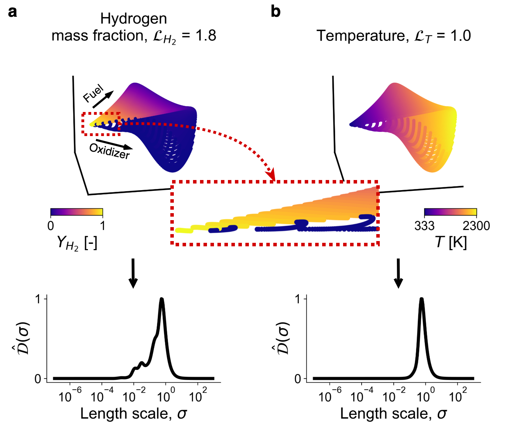
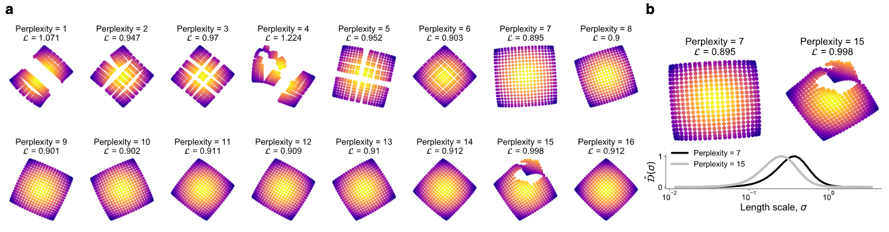

# Cost function for low-dimensional manifold topology assessment

This repository contains Jupyter notebooks and materials associated with the publication:

> K. Zdybał, E. Armstrong, J.C. Sutherland, A. Parente - *Cost function for low-dimensional manifold topology assessment*.

----

## Seminar talk

The seminar talk associated with this publication can be found [here](https://www.vki.ac.be/index.php/vki-seminars).

----

## Reproducing paper results

To reproduce the results included in the original publication (and in the supplementary material), several Python libraries are required. Mainly, the [PCAfold](https://pcafold.readthedocs.io/en/latest/index.html) library developed by the authors contains the implementation of the cost function; it also introduces several functions and algorithms used throughout the work. The installation instructions can be found in the linked documentation page. [umap-learn](https://umap-learn.readthedocs.io/en/latest/index.html) package can be installed through `pip install umap-learn`. [pyDML](https://pydml.readthedocs.io/en/latest/index.html) package can be installed through `pip install pydml`.

Below is a complete list of required libraries:

```
numpy
pandas
copy
time
random
pickle
csv
ast
PCAfold
tensorflow
keras
sklearn
dml
umap
scipy
plotly
matplotlib
```

Random seed `100` is used throughout this work.

### Jupyter notebooks

#### [▶︎ Cost function demonstration](code/paper-Figure-1-cost-function-demonstration.ipynb)

This notebook can be used to reproduce the figure:


#### [▶︎ Cost function behavior on toy functions](code/paper-Figure-2-cost-function-behavior-on-toy-functions.ipynb)

This notebook can be used to reproduce the figure:


#### [▶︎ Cost function application to detecting large gradients](code/paper-Figure-4-cost-function-application-to-detecting-large-gradients.ipynb)

This notebook can be used to reproduce the figure:



#### [▶︎ Cost function analysis of the atmospheric physics dataset](code/paper-Figure-6-atmospheric-physics.ipynb)

This notebook can be used to reproduce the figure:


#### [▶︎ Cost function application to categorical data](code/paper-Figure-7-cost-function-application-to-categorical-data.ipynb)

This notebook can be used to reproduce the figure:


#### [▶︎ Cost function assessment of swiss roll data projections](code/paper-Supplement-swiss-roll-data.ipynb)

This notebook can be used to reproduce the figure:


#### [▶︎ Cost function application to hyper-parameter tuning in t-SNE](code/paper-Supplement-cost-function-application-to-hyper-parameter-tuning.ipynb)

This notebook can be used to reproduce the figures:




#### [▶︎ Cost function sensitivity to data sampling](code/paper-Supplement-sensitivity-to-data-sampling.ipynb)

This notebook can be used to reproduce the figure:

