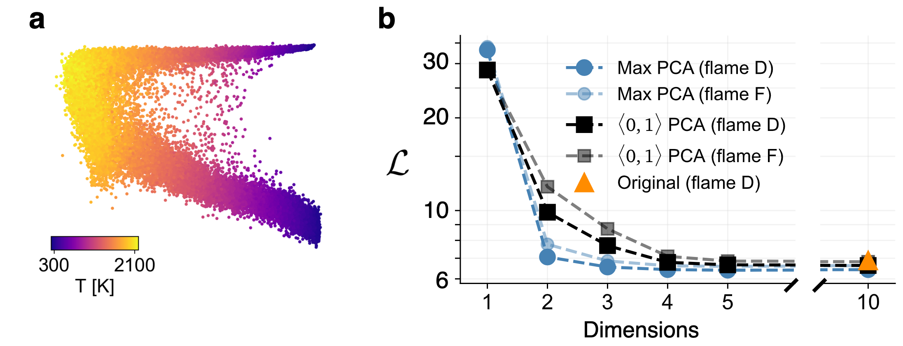

This repository is licensed under: [](https://creativecommons.org/licenses/by-nc/4.0/)

# Cost function for low-dimensional manifold topology assessment

This repository contains Jupyter notebooks and materials associated with the publication:

> Zdybał, K., Armstrong, E., Sutherland, J.C. and Parente, A., 2022. Cost function for low-dimensional manifold topology assessment. *Scientific Reports*, 12(1), pp.1-19.

You can find the open-source article here: https://www.nature.com/articles/s41598-022-18655-1.

BibTeX citation:

```
@article{zdybal2022cost,
  title={Cost function for low-dimensional manifold topology assessment},
  author={Zdyba{\l}, Kamila and Armstrong, Elizabeth and Sutherland, James C and Parente, Alessandro},
  journal={Scientific Reports},
  volume={12},
  number={1},
  pages={1--19},
  year={2022},
  publisher={Nature Publishing Group}
}
```

## Seminar talk

The seminar talk associated with this publication can be found [here](https://www.vki.ac.be/index.php/vki-seminars).

## Data availability

The datasets generated during or analyzed during the current study are available in the [``data``](data/) directory. The atmospheric physics dataset and the plasma physics dataset are property of Université libre de Bruxelles.

The Sandia flames data can be accessed at: [tnfworkshop.org/data-archives/pilotedjet/ch4-air](https://tnfworkshop.org/data-archives/pilotedjet/ch4-air).

## Reproducing paper results

All code needed to reproduce results included in the original publication (and in the supplementary material) is stored in the [``code``](code/) directory.

Several Python libraries are required (see [`requirements.txt`](requirements.txt)). Mainly, the [PCAfold](https://pcafold.readthedocs.io/en/latest/index.html) library developed by the authors contains the implementation of the cost function; it also introduces several functions and algorithms used throughout the work. The installation instructions can be found in the linked documentation page. [umap-learn](https://umap-learn.readthedocs.io/en/latest/index.html) package can be installed through `pip install umap-learn`. [pyDML](https://pydml.readthedocs.io/en/latest/index.html) package can be installed through `pip install pydml`.

Random seed `100` is used throughout this work.

### Jupyter notebooks


#### [▶︎ Non-uniqueness illustrative demonstration](code/paper-Figure-1-non-uniqueness-demo.ipynb)

This notebook can be used to reproduce the figure:


#### [▶︎ Cost function demonstration](code/paper-Figure-2-cost-function-demonstration.ipynb)

This notebook can be used to reproduce the figure:


#### [▶︎ Cost function behavior on toy functions](code/paper-Figure-3-cost-function-behavior-on-toy-functions.ipynb)

This notebook can be used to reproduce the figure:


#### [▶︎ Cost function analysis of the plasma physics and reacting flow datasets](code/paper-Figure-4-plasma-physics-and-reacting-flows.ipynb)

This notebook can be used to reproduce the figure:


#### [▶︎ Cost function application to detecting large gradients](code/paper-Figure-5-cost-function-application-to-detecting-large-gradients.ipynb)

This notebook can be used to reproduce the figure:


#### [▶︎ Cost function behavior with increasing manifold dimensionality](code/paper-Figure-6-cost-dimensionality-Sandia-flame.ipynb)

This notebook can be used to reproduce the figure:



#### [▶︎ Cost function analysis of the atmospheric physics dataset](code/paper-Figure-7-atmospheric-physics.ipynb)
#### [▶︎ Relating the cost function and nonlinear regression predictions](code/paper-Figure-7-atmospheric-physics-regression-correlation.ipynb)

These two notebooks can be used to reproduce the figure:


#### [▶︎ Cost function application to categorical data](code/paper-Figure-8-cost-function-application-to-categorical-data.ipynb)

This notebook can be used to reproduce the figure:


#### [▶︎ Cost function's hyper-parameters on toy functions](code/paper-Figure-9-effect-of-hyper-parameters.ipynb)
#### [▶︎ Cost function's assessment of swiss roll data projections](code/paper-Figure-9-swiss-roll-data.ipynb)
#### [▶︎ Cost function's hyper-parameters on swiss roll data projections](code/paper-Figure-9-swiss-roll-data-effect-of-hyper-parameters.ipynb)

These notebooks can be used to reproduce the figure:


-------

#### [▶︎ Cost function application to hyper-parameter tuning in t-SNE](code/paper-Supplement-t-SNE-perplexity-tuning.ipynb)
#### [▶︎ Cost function application to perplexity generalization in t-SNE](code/paper-Supplement-t-SNE-perplexity-generalization.ipynb)

These notebook can be used to reproduce the figures:


#### [▶︎ Cost function sensitivity to data sampling](code/paper-Supplement-sensitivity-to-data-sampling.ipynb)

This notebook can be used to reproduce the figure:


